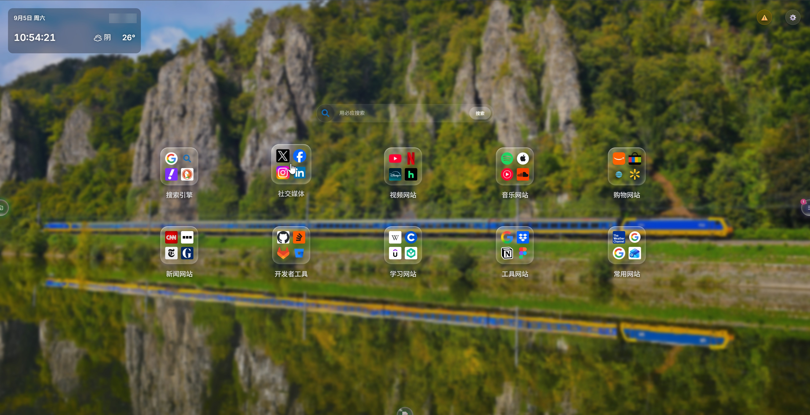
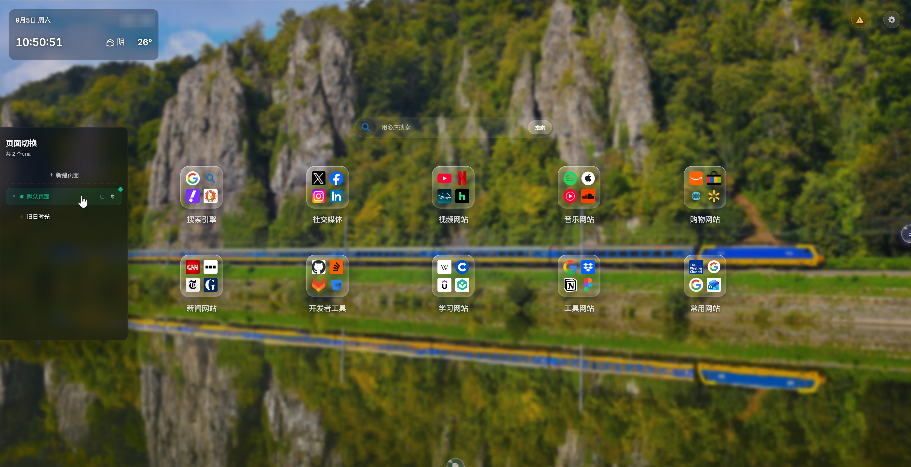
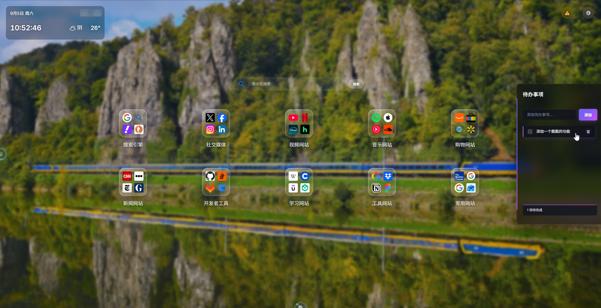
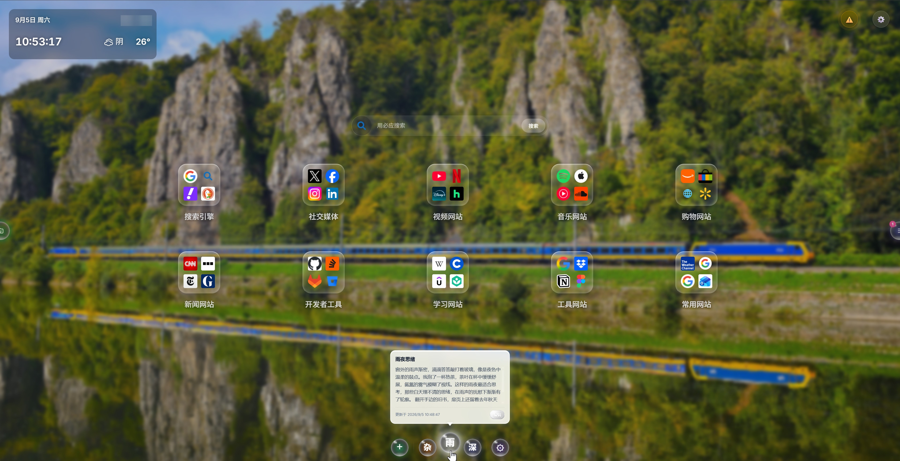
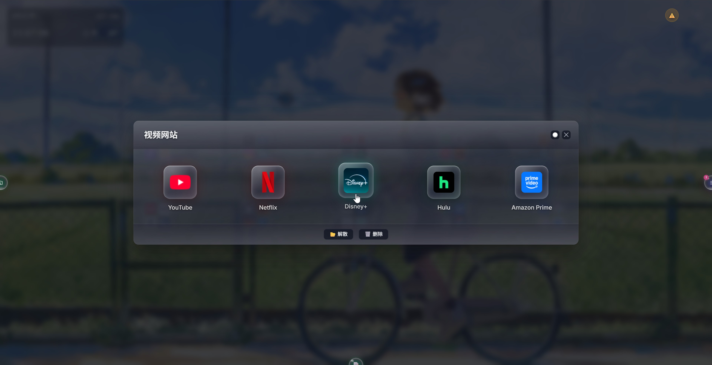
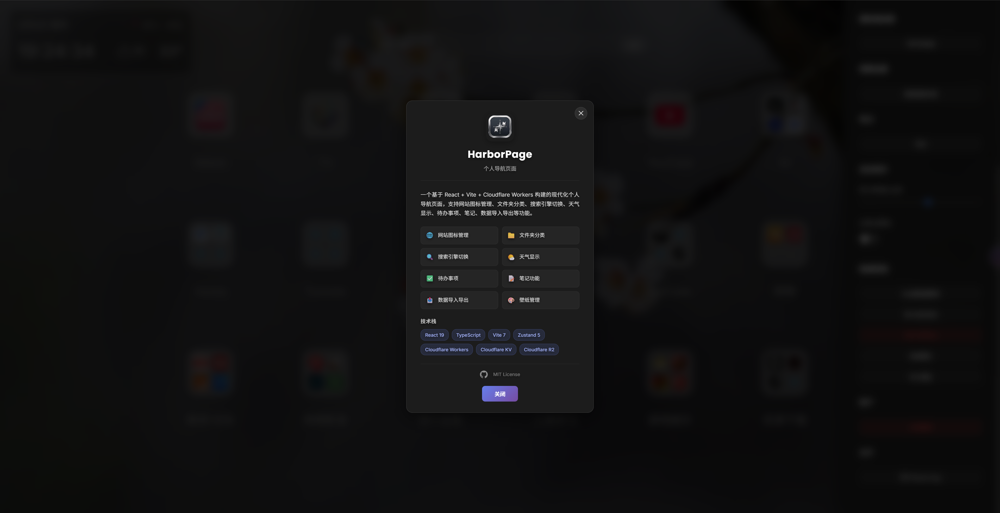

# HarborPage - Personal Navigation Page

A modern personal navigation page built with React + Vite + Cloudflare Workers, supporting website icon management, folder categorization, search engine switching, weather display, to-do lists, notes, data import/export, and more, with a built-in Simplified Chinese / English bilingual interface.

## 📸 Interface Preview

Main interface overview:

<p align="center">
  
  <br />
  <sub><b>Main interface</b> · wallpaper + icon grid + search / weather / half-hidden crystal ball entries on both sides</sub>
</p>

The three edge entry balls:

<table align="center">
  <tr>
    <td align="center">
      
      <br />
      <sub><b>Multi-page</b> · left-edge entry ball expands PagesSidebar</sub>
    </td>
    <td align="center">
      
      <br />
      <sub><b>To-do</b> · right-edge entry ball expands the todo sidebar</sub>
    </td>
    <td align="center">
      
      <br />
      <sub><b>Notes</b> · bottom entry ball reveals the note bar on hover</sub>
    </td>
  </tr>
</table>

Windows and dialogs:

<p align="center">
  
  <br />
  <sub><b>Folder window</b> · crystal block icons + layered material glass (colors follow the folder color)</sub>
</p>

<p align="center">
  
  <br />
  <sub><b>About</b> · the About HarborPage dialog</sub>
</p>

## ✨ Features

### 🌐 Website Icon Management
- Add, edit, and delete website shortcuts
- Multi-source icon retrieval: HTML parsing, common path probing, multi-favicon-source fallback
- Three ways to provide an icon: icon URL, text (generates a colored text icon), or emoji
- Smart icon fetch dialog: automatically collects candidate icons from multiple channels for you to choose from
- Icons cached to Cloudflare R2 (optional), with semaphore-based concurrency control on the frontend (3 concurrent)
- Drag-and-drop sorting and icon moving
- Context menu for quick actions
- Long press to enter edit mode
- Icon / folder icons are rendered with a "crystal block" glass texture, colorable with the 16 global palette colors or a custom color (see "Color System" below)

### 📁 Folder Features
- Drag an icon onto another icon to create a folder
- Folder icons show the icons of the first 4 websites (in a 2×2 grid)
- Folder names can be renamed
- Drag icons into and out of folders
- Empty folders display a 📁 icon
- The folder window's overall color follows the folder's current color (layered translucent material tinting — header/content/footer each have their own layer while preserving the glass texture)
- Right-click on empty space in the folder window to add a website directly to that folder
- The empty folder content area keeps at least one row of icon height so it is easy to view and drop into
- A whole folder can be moved between pages (including all its child websites)

### 🎨 Color System: Global Palette and Color Picker
- **16 global palette slots**: fixed positions (`palette-1 … palette-16`, representing position only, with no color semantics); ships with 16 default colors (white first, the rest in a hue gradient); slot colors can be reset at any time in the settings panel
- **Color picker window**: pick between the 16 system preset colors and "Custom" (rainbow gradient + native color picker); while editing a slot you can "Reset to default" to restore the factory color
- **Selection mode (assign a color to an element)**: websites, folders, and notes all share the same palette — clicking a slot selects that slot's color; clicking the already-selected slot again or the "Custom" button opens the color picker
- **Settings mode (settings panel)**: clicking any slot opens the color picker directly; icons, folders, and notes bound to that slot recolor in real time
- **Natural wrapping layout**: the 16 slots and the custom button live in the same flex-wrap flow and arrange themselves by container width (e.g. a single row in the note editor, wrapping in the edit-site dialog, 4×4 for folder coloring, 2×8 in the settings sidebar)
- **Friendly color hints**: factory preset slots show a Chinese color name (white, yellow, blue…), custom colors show their hex value
- **Smooth compatibility**: color names / snapshot colors in old data are still displayed and automatically upgraded to slot references on read; palette changes participate in cloud sync and import/export

### 🗂️ Multi-Page Features
- Page-level isolation: each page has its own set of websites and folders
- A half-hidden "crystal ball" entry ball on the left edge of the screen (emerald→amber identity color, six gradient layers + breathing glow); it slides out on hover and expands PagesSidebar on click (after the panel opens the ball rotates and fades out to make room; click anywhere outside the panel to collapse)
- Create, rename, and delete pages (at least one page is always kept)
- Drag-and-drop page sorting (native HTML5 drag with upper/lower half drop indicators)
- Cross-page moving of websites/folders: context menu "Move to page…", supporting both "Move only" and "Move and jump"
- Refreshing the page always shows the first page by default (the currently selected page is not written to persistent storage)
- Old-format data (root-level `websites` with no `pages`) is automatically migrated into a page named "Default Page"
- Importing old-format data always lands on "Default Page" (created automatically if missing), and jumps to that page after the import completes

### 🔍 Search Features
- Multiple search engines (Google, Baidu, Bing, etc.)
- Add, edit, and delete custom search engines
- Automatic search engine icon retrieval
- Drag-and-drop search engine sorting
- Quick search engine switching from the main page dropdown (temporary switch — not persisted, does not trigger a save prompt)
- The default search engine can be changed in the settings panel (properly persisted and synced to the cloud)

### 🌤️ Weather Display
- Real-time weather information
- Supports both browser geolocation and IP-based location
- QWeather API support
- Shows the current temperature and weather condition
- Shows time and date (click the date to toggle the lunar calendar)
- The clock uses direct DOM manipulation via ref to avoid triggering a React re-render every second

### ✅ To-Do List
- A half-hidden "crystal ball" entry ball on the right edge of the screen (indigo→magenta identity color, drawn the same way as the page entry ball); click to expand the todo sidebar (close: click anywhere outside the panel)
- Add, edit, and delete to-dos
- Mark completion status
- Data persisted to Cloudflare KV
- Unfinished-count badge (overlaid on the top-left of the entry ball)

### 📝 Notes
- A centered "crystal ball" note bar at the bottom of the screen: when collapsed only half of a 📝 peek ball is visible; hovering raises and expands the whole bar
- The bar shows up to 8 notes; each ball is rendered as a crystal ball in the note's color with the first character of the title, and hovering opens a thumbnail preview bubble (with the update time and an "Edit" entry point)
- Note balls support drag-and-drop sorting; clicking any ball opens the editor directly (full text view, edit title/color/content, save or delete)
- The "+" on the left creates a new note (it is only really created when you click "Save"), and the "⚙︎" on the right opens the note manager (view all, batch reorder, rename, recolor, delete); when there are more than 8 notes a +N badge is shown
- Supports title and content, with created and updated timestamps
- Note colors come from the global palette (16 slots + custom), unified with the website/folder color system

### 🎨 Wallpaper Management
- Gradient background (default)
- Solid color background
- Bing daily wallpaper
- Random Bing wallpaper
- Custom image URL
- Local image upload (R2 or IndexedDB fallback storage)
- Blur and overlay opacity adjustment
- Wallpaper proxy support (with domain allowlist restriction)
- Automatic scheduled rotation: enable it and set a 1–24 hour interval (only effective for Bing daily / random Bing / custom URL, with `lastAutoChangeAt` as the anchor for the countdown)

### 📤 Data Import/Export
- Categorized export: search engines, pages (including websites), websites (old format), todo list, notes, other settings, palette
- Categorized import: check the data categories to import (the palette is only offered when it has been modified, and is merged by slot)
- On import, data categories not present in the file are detected automatically and disabled
- Import progress bar showing the current progress and task
- An overlay blocks user interaction during import
- ID conflicts are handled automatically on import (merge mode generates new IDs)
- Icons are pre-cached automatically after import

### 🔐 Security & Authentication
- JWT login authentication
- Password transmitted with SHA-256 encryption
- 7-day token validity
- Automatic logout handling
- Sensitive information stored in Cloudflare Secrets
- Build output automatically cleans up the `.dev.vars` secrets file

### 🌏 Multilingual Interface (i18n)
- Ships with Simplified Chinese / English UI copy covering 16 namespaces (common, settings, auth, about, weather, todos, notes, search, pages, folder, wallpaper, sites, icons, importExport, feature dock, system)
- Automatic language detection: locally stored preference → browser language → Simplified Chinese as the default
- Switch anytime in Settings → Personalization → Interface language; the change takes effect immediately and is persisted locally (key `harborpage_language`)
- Backend APIs return only language-neutral error codes / icon source identifiers (`shared/apiErrors.ts`), which the frontend translates centrally (`src/utils/apiErrorUtils.ts`)

### ⚙️ Settings Panel (right-side drawer with grouped sections)
- **Personalization**: site title, interface language, change wallpaper, desktop icon settings (rows/columns), manage icon sources, palette management (2×8 settings mode — click any slot to recolor and give slots an alias, plus a global lightness adjustment from −50 to 50 with live preview; icons, folders, and notes using that slot update automatically)
- **Preferences**: manage search engines, auto-save settings
- **Feature toggles**: show/hide switches for the weather / search / notes / todos / multi-page modules (turning one off hides both its entry ball and its panel)
- **Data management**: load data from the cloud, import preset sites, data import/export, clear all sites
- **Account & About**: sign out, About HarborPage

### 💾 Auto-Save
- Unsaved change detection and prompting
- Countdown auto-save (configurable duration)
- Save progress indication
- Manual and automatic saving coexist
- Unsaved changes prompt before page refresh

## 🛠️ Tech Stack

### Frontend
- **React 19** - UI library
- **TypeScript** - Type safety
- **Vite 7** - Build tool
- **Zustand 5** - State management
- **i18next 26 + react-i18next 17** - Internationalization (i18n)
- **lunisolar 2** - Lunar calendar conversion
- **qweather-icons 1** - Weather icons
- **Crypto-JS** - SHA-256 encryption

### Backend
- **Cloudflare Workers** - Serverless compute
- **Cloudflare KV** - Data storage
- **Cloudflare R2** - Icon file storage
- **jose 6** - JWT authentication
- **Wrangler 4** - Cloudflare CLI

## 📦 Installation and Deployment

### Prerequisites
- Node.js 20.19+ / 22.12+ (required by Vite 7)
- A Cloudflare account
- Wrangler CLI 4+

### Local Development

```bash
# Install dependencies
npm install

# Copy the environment variable configuration
cp .dev.vars.sample .dev.vars
cp wrangler.sample.jsonc wrangler.jsonc

# Fill in the sensitive values in .dev.vars
# Fill in the KV and R2 resource IDs in wrangler.jsonc

# Start the dev server (with hot reload)
npm run dev
```

### Common Scripts

| Command | Description |
|------|------|
| `npm run dev` | Start the dev server (`wrangler dev`, with hot reload) |
| `npm run dev:vite` | Start only the Vite frontend dev server |
| `npm run build` | Type-check and build the production output |
| `npm run build:watch` | Build and watch for changes |
| `npm run preview` | Build, then preview the Worker locally |
| `npm run deploy` | Build and deploy to Cloudflare Workers |
| `npm run cf-typegen` | Generate Cloudflare Workers types |
| `npm run lint` | Run ESLint |

### Deploying to Cloudflare

```bash
# Build the project
npm run build

# Deploy to Cloudflare Workers
npm run deploy
```

### Configuration Steps

1. **Create a KV namespace**
   ```bash
   wrangler kv:namespace create USER_DATA
   ```

2. **Create an R2 bucket (optional, for icon caching)**
   ```bash
   wrangler r2:bucket create harbor
   ```

3. **Set the sensitive environment variables (production)**
   ```bash
   wrangler secret put PASSWORD
   wrangler secret put JWT_SECRET
   wrangler secret put WEATHER_API_KEY
   wrangler secret put WEATHER_API_HOST
   ```

4. **Configure wrangler.jsonc**
   - Put the KV namespace ID into `kv_namespaces[0].id`
   - Put the R2 bucket name into `r2_buckets[0].bucket_name`
   - Configure `R2_URL` (needed when R2 CDN is enabled)

### Environment Variables

| Name | Description | Required |
|--------|------|----------|
| `PASSWORD` | Login password | Yes |
| `JWT_SECRET` | JWT signing secret | Yes |
| `WEATHER_API_KEY` | QWeather API key | No |
| `WEATHER_API_HOST` | QWeather API host | No |
| `R2_URL` | R2 storage access URL (needed when R2 CDN is enabled) | No |
| `ENABLE_R2_CDN` | Whether to enable the R2 CDN (off by default) | No |

### KV Namespace Bindings
- `USER_DATA` - User data storage

### R2 Bucket Bindings
- `BUCKET` - Icon file storage (optional)

## 🎯 Usage Guide

### Basic Operations
1. **Log in**: open the page and enter the password
2. **Switch pages**: click the emerald→amber "crystal ball" entry ball on the left edge of the screen to expand PagesSidebar, then click a page to switch (click anywhere outside the panel to collapse); drag the handle to reorder
3. **Create a page**: the "+ New Page" button at the top of PagesSidebar
4. **Rename/delete a page**: use the pencil icon on the right of a page item to rename (Enter to confirm / Esc to cancel) and the trash icon to delete (with a second confirmation, at least one page is kept)
5. **Add a website**: right-click on empty space on the page to open the "Add Website" window directly; you can also long-press empty space to enter edit mode and click "+". Sites added by right-clicking empty space inside a folder window go into the current folder
6. **Edit a website**: right-click the website icon and choose "Edit"
7. **Delete a website**: right-click the website icon and choose "Delete"
8. **Assign a color to an element**: the website/folder edit dialog and the note editor share the same palette — click one of the 16 slots to apply that color; clicking "Custom" or clicking the already-selected slot again opens the color picker
9. **Manage the palette**: Settings → Personalization → Palette; click any swatch to reset that slot's color, and icons, folders, and notes using that slot update in real time
10. **Create a folder**: drag one website icon onto another website icon
11. **Move an icon**: drag a website icon onto a folder icon to move it into the folder
12. **Move out of a folder**: drag an icon in the folder window to outside the window
13. **Move websites/folders across pages**: right-click a website or folder → "Move to page…" → choose "Move only" or "Move and jump"
14. **Open the to-dos**: click the indigo→magenta "crystal ball" entry ball on the right edge of the screen to expand the todo sidebar (click anywhere outside the panel to collapse); the badge at the top-left shows the unfinished count in real time
15. **Open the note bar**: hover the 📝 "crystal ball" note ball at the bottom center of the screen and the whole bar expands — hover a note ball for a thumbnail preview, click a ball to open the editor, drag a ball to reorder, and use "⚙︎" on the right to manage all notes
16. **Switch the interface language**: Settings → Personalization → Interface language, and toggle between Simplified Chinese / English (effective immediately and persisted locally)

### Icon Settings
- **Leave empty**: automatically fetch the website favicon
- **Icon URL**: enter an image URL directly
- **Text**: enter any text (e.g. "Ba") to generate a colored text icon
- **Emoji**: enter an emoji character (e.g. 🚀)
- **Upload**: manually upload an icon to R2
- **Smart fetch**: automatically collect candidate icons from the HTML, common paths, and icon sources

### Search
1. Type a keyword into the search box
2. Click a search engine icon or use the dropdown to switch engines (**switching on the main page is temporary — refreshing returns to the default engine**)
3. Press Enter or click the search button to run the search
4. To permanently change the default search engine: Settings panel → Search settings → Manage search engines

### Wallpaper Settings
1. Click the settings button (⚙️) to open the settings panel
2. Choose "Wallpaper settings"
3. Choose a wallpaper source (gradient / solid color / Bing daily wallpaper / random Bing wallpaper / custom image URL / local image)
4. Adjust the blur and overlay opacity
5. To rotate automatically: enable it and set a 1–24 hour interval (only effective for Bing daily / random Bing / custom URL)

### Data Import/Export
1. Open the settings panel
2. Choose "Import/Export"
3. Export: check the data categories to export and click Export
4. Import: choose the import file, check the data categories to import, and confirm the import
5. A progress bar is shown during import and other interaction is blocked

## 📁 Project Structure

```
harborpage/
├── shared/                          # Code shared between frontend and backend
│   ├── apiErrors.ts                 # API error codes / icon source identifiers (language-neutral, for frontend i18n)
│   └── constants.ts                 # TRACKED_KEYS persistence tracking keys (including palette / paletteAliases / paletteLightness)
├── public/                          # Static assets
├── screenshots/                     # UI preview screenshots
├── samples/                         # Design reference samples (plain HTML)
│   ├── CrystalBall.html             # Crystal ball drawing reference (edge entry balls / note balls)
│   ├── Crystal_block.html           # Crystal block (icon) inset edge highlight reference
│   ├── New.html / v3.html           # Layout reference
├── src/                             # Frontend source code
│   ├── assets/                      # Static assets
│   ├── components/                  # React components (styles use a .css file with the same name)
│   │   ├── common/                  # Shared components
│   │   │   ├── AboutDialog.tsx      # "About" dialog
│   │   │   ├── AutoFetchDialog.tsx  # Smart icon fetch dialog
│   │   │   ├── ColorPickerWindow.tsx # Color picker window (16 presets + custom + reset to default)
│   │   │   ├── ConfirmDialog.tsx    # Confirmation dialog
│   │   │   ├── CrystalShell.tsx     # Crystal icon light-effect layers (shared by site/folder icons)
│   │   │   ├── DraggableIconWrapper.tsx # Drag wrapper layer
│   │   │   ├── EditWebsite.tsx      # Website/folder edit form (including palette)
│   │   │   ├── ErrorBoundary.tsx    # Error boundary
│   │   │   ├── FeatureDock.tsx      # Feature dock: consumes the registry, renders shared entry balls per slot config
│   │   │   ├── FolderItem.tsx       # Folder icon
│   │   │   ├── FolderNameDialog.tsx # Folder name dialog
│   │   │   ├── IconGrid.tsx         # Icon grid
│   │   │   ├── IconItem.tsx         # Icon item (crystal block)
│   │   │   ├── ImportProgressOverlay.tsx # Import progress overlay
│   │   │   ├── LoginModal.tsx       # Login modal
│   │   │   ├── MoveToPageDialog.tsx # Cross-page move dialog
│   │   │   ├── Notes.tsx            # Notes component
│   │   │   ├── PalettePicker.tsx    # Palette (selection/settings mode, natural flex-wrap)
│   │   │   ├── PeekBall.tsx         # Shared "crystal ball" entry ball (presentational only; styles in PeekBall.css)
│   │   │   ├── SaveProgressIndicator.tsx / SavePrompt.tsx / SaveTooltip.tsx  # Save feedback
│   │   │   ├── Toast.tsx            # Toast notifications
│   │   │   ├── TodoList.tsx         # Todo list
│   │   │   ├── TreeSelector.tsx     # Tree selector
│   │   │   └── WebsiteItem.tsx      # Website item (with context menu)
│   │   ├── features/                # Feature components
│   │   │   ├── FolderWindow.tsx     # Folder window (colors follow the folder color)
│   │   │   ├── PagesSidebar.tsx     # Pages sidebar (multi-page switch/sort/rename/delete)
│   │   │   ├── Search.tsx           # Search bar
│   │   │   ├── SearchManager.tsx    # Search engine management
│   │   │   ├── TodoSidebar.tsx      # Todo sidebar
│   │   │   ├── WallpaperManager.tsx # Wallpaper management
│   │   │   └── Weather.tsx          # Weather display
│   │   ├── layout/                  # Layout components
│   │   │   ├── Background.tsx       # Background layer
│   │   │   └── IconsContainer.tsx   # Icon container
│   │   └── ui/                      # UI components
│   │       ├── AutoSaveSettings.tsx # Auto-save settings
│   │       ├── FaviconSettings.tsx  # Icon source settings
│   │       ├── IconSettings.tsx     # Desktop icon settings
│   │       ├── ImportExport.tsx     # Data import/export (including the palette category)
│   │       ├── ImportPresetDialog.tsx # Preset site import
│   │       ├── NoteBar.tsx          # Bottom crystal note bar (peek to expand)
│   │       ├── NoteEditorDialog.tsx # Note editor (with palette color picking)
│   │       ├── NotesManagerDialog.tsx # Note manager
│   │       ├── Settings.tsx         # Settings panel (including palette management)
│   │       └── SettingsWindow.tsx   # Settings window shell
│   ├── data/                        # Data files
│   │   └── presetSites.json         # Preset site data
│   ├── hooks/                       # Custom hooks
│   │   ├── useAuth / useAutoSave / useAutoSaveSettings / useClickOutside / useFeatureEntry
│   │   ├── useDataInitialization / useDeleteIcon / useDragAndDrop / useIconDropHandler
│   │   ├── useImport / useLongPress / useAddWebsiteShortcut / useTreeSelection
│   │   └── useWallpaperInit / useWallpaperAutoChange / useWeather / useWeatherLocation / useWeatherLunar
│   ├── i18n/                        # Internationalization (i18next)
│   │   ├── locales/                 # 16 namespaces each for zh-CN / en-US
│   │   ├── index.ts                 # Language detection / initialization / switching
│   │   └── i18next.d.ts             # Type declarations
│   ├── services/                    # Service layer
│   │   ├── AuthService / ConfigService / FaviconConfigService / ChangeTracker
│   │   ├── DataRepository           # Unified persistence layer
│   │   ├── DataManager / storeInitializer
│   │   ├── IconManager / IconDownloadQueue / autoFetchService / iconUtils
│   │   └── Services / serviceContainer
│   ├── store/                       # State management (Zustand)
│   │   ├── useFeatureDockStore.ts   # Feature dock registry (entry descriptors `entries` + panel open/close `open`)
│   │   ├── usePagesStore.ts         # Pages + page-level website collections (source of truth)
│   │   ├── useIconsStore.ts         # Current page icon view (derived)
│   │   ├── usePaletteStore.ts       # Global palette (16 slots)
│   │   ├── useNotesStore / useTodoStore / useSearchStore / useSettingsStore
│   │   ├── useWallpaperStore / useImportStore / useIconsUIStore
│   │   └── index.ts / persistence.ts / selectors.ts
│   ├── types/index.ts               # Type definitions (including the palette-1…16 slot documentation)
│   ├── utils/                       # Utility functions
│   │   ├── paletteColors.ts         # Palette core (slot normalization / color-name description / selection construction / global lightness)
│   │   ├── noteColors.ts            # Note preset colors
│   │   ├── colorUtils.ts            # Color conversion (hex/hsl, etc.)
│   │   ├── apiErrorUtils.ts         # API error code → i18n copy translation
│   │   ├── wallpaperRefresh.ts      # Bing wallpaper fetch / random wallpaper / cache busting
│   │   └── deviceUtils / idUtils / importExportUtils / logger / wallpaperStorage
│   ├── App.tsx / main.tsx / constants.ts / index.css / App.css
├── worker/                          # Cloudflare Workers code
│   ├── middleware/
│   │   └── auth.ts                  # Authentication middleware
│   ├── routes/                      # API routes (auth/data/icon/icon-upload/icon-cleanup/title/bing/wallpaper/wallpaper-upload/weather)
│   ├── utils/                       # constants/crypto/icon/md5/streamLimit
│   ├── index.ts                     # Worker entry point
│   └── types.ts                     # Worker types
├── .dev.vars.sample                 # Local environment variable sample
├── .env.sample                      # Frontend build variable sample
├── wrangler.sample.jsonc            # Wrangler configuration sample
├── vite.config.ts / package.json / tsconfig*.json
└── LICENSE
```

## 🔧 API Endpoints

### Authentication
- `POST /api/login` - User login
- `GET /api/auth/status` - Check authentication status
- `GET /api/config` - Get the frontend runtime configuration (requires auth; returns `r2Url` / `enableR2Cdn` / `r2StorageAvailable` / `weatherApiAvailable`)

### Data Management
- `GET /api/data` - Get all user data
- `GET /api/data?key={key}` - Get a single data entry
- `POST /api/data?key={key}` - Save user data
- `DELETE /api/data?key={key}` - Delete user data

### Icon Management
- `GET /api/icon?type={type}&hashInput={hashInput}&downloadUrl={downloadUrl}` - Get an icon (from R2 or by downloading)
- `POST /api/icon` - Download and cache an icon to R2
- `POST /api/icon/upload` - Upload an icon (requires auth; when R2 is available, file size limit is 100KB)
- `DELETE /api/icon?type={type}&hashInput={hashInput}` - Delete an icon (requires auth)
- `DELETE /api/icon?action=cleanup` - Clean up unused icons (requires auth, supports batched cleanup)
- `GET /api/icon/autofetch?url={url}` - Get the list of website icon candidates (analyzes the page structure only, does not download)
- `POST /api/icon/download` - Download a single icon and return a data URL (for concurrent frontend calls)
- `POST /api/icon/autofetch/cache` - Cache a data URL icon to R2
- `POST /api/icon/cache-url` - Cache the icon at the given URL to R2

### Icon Source Management
- `GET /api/icon/sources/defaults` - Get the system default icon sources (no auth required)
- `GET /api/favicon/sources` - Get the favicon source configuration
- `POST /api/favicon/sources` - Save the favicon source configuration

### Weather Service
- `GET /api/weather?lat={lat}&lon={lon}` - Get weather information
- `GET /api/geo?location={location}` - City search

### Wallpaper Proxy
- `GET /api/wallpaper?url={url}` - Wallpaper image proxy (with domain allowlist restriction)
- `POST /api/wallpaper/upload` - Upload a wallpaper to R2

### Bing API Proxy
- `GET /api/bing/*` - Proxy Bing API requests

### Title Retrieval
- `GET /api/title?url={url}` - Get the website title

## 🎨 Customization

### Adding a Custom Search Engine
1. Open the settings panel
2. Choose "Search settings"
3. Click "Manage search engines"
4. Click to add or edit an existing search engine

### Configuring Favicon Sources
1. Open the settings panel
2. Choose "Icon source settings"
3. Add, edit, delete, or drag to reorder favicon sources
- The system provides three sources by default: Google, DuckDuckGo, and Favicon (the defaults are served by the backend; the frontend fetches them via `GET /api/icon/sources/defaults`)
- They are tried in priority order until a valid icon is obtained

### Changing the Icon Row/Column Count
1. Open the settings panel
2. Choose "Icon settings"
3. Adjust the row and column counts

### Enabling R2 Icon Caching
1. Create and bind an R2 bucket
2. Configure the `R2_URL` environment variable
3. Set `ENABLE_R2_CDN` to `"true"`

## 📝 Development Notes

### Component-Based Development
The project follows a component-based development model: every feature module has its own component and stylesheet.

### Feature Dock Architecture (Peek Ball Entry System)

The "edge entry balls" for multi-page / todos / notes are all driven by a single inverted-dependency system (mirroring WPF's "feature creates the entry ball → host configures and renders it" model):

- **Registry**: `useFeatureDockStore` (Zustand) holds two tables — `entries` (entry descriptors) and `open` (panel open/close)
- **Feature-side registration**: feature components call `useFeatureEntry(id, descriptor)` to `register` on mount and `unregister` on unmount — turning the feature switch off (or logging out) unmounts the component, which automatically removes the entry ball and clears the `open` state, so the host never has to maintain the switch; after each render `updateEntry` syncs the latest label / badge / hover callback into the registry
- **Host rendering**: `FeatureDock` does not import any feature component; it only consumes the registry according to a static slot table. Each slot configures three working parameters — placement, presentation, and interaction — and a slot is not rendered when its `entry` is missing
- **Shared entry ball**: `PeekBall` is a purely presentational component (zero coupling with features); it only receives `entry` (content) + `slot` (working parameters) + `active` + `onOpen/onToggle`
- **Open/close coordination**: `open` is the single source of truth for the ball and the feature panel — the ball reads it to decide its `is-active` visuals, and the panel reads it to decide mounting (`present`) and expansion (`expanded`). Panel mount/collapse is driven asynchronously by timers (mount in the collapsed state for one frame → expand and slide in 30ms later; on close, collapse first → unmount after the exit animation finishes and clear transient state such as the second-confirmation prompt); synchronous setState is never placed inside an effect or a render-time adjustment, avoiding React 19's occasional dropped-state issue on first interaction
- **Slots and interaction**: `pages` / `todos` = `panel-slide` + `click-toggle` (expand on click; once open the ball rotates 180° and fades out to make room, and clicking outside the panel collapses); `notes` = `bar-reveal` + `hover-open` (expands on hover and collapses on leave via `onHoverEnd`, with tap as a touch fallback)

### Visual Design (Crystal Ball System)
- The three "edge entry balls" — pages (left edge), todos (right edge), and the notes peek ball (bottom edge) — and the note balls all use the crystal ball drawing technique from `samples/CrystalBall.html`
- Crystal ball = six gradient layers on a single element (dark glass base → low-opacity identity-color inner light → primary/secondary highlights → bottom crescent reflection) + inset inner-wall refraction + a bottom identity-color ambient glow, **with no white outline ring** (to avoid a plastic look)
- The three edge entry balls are rendered uniformly by the shared `PeekBall` component (placed per slot by `FeatureDock`): the identity colors `--tint` / `--tint-2` come from the feature's registered descriptor and are inlined onto the ball root, and the 7 derived `--ball-*` variables are generated uniformly via `color-mix` inside PeekBall.css
- The breathing animation is `paused` by default (to avoid continuous raster work and CPU usage when idle) and only runs on hover / expansion
- Website / folder icons use a "crystal block" glass texture: the light-effect layers are provided by `CrystalShell` and driven by `.icon-circle > .cc-*` in IconItem.css, adding an inset edge highlight (a sense of glass thickness) per `samples/Crystal_block.html`; colors are driven by the `--c-hue/--c-sat/--c-lit` HSL variables and follow the palette, with the inner light intensifying on hover
- The folder window's colors follow the folder's current color (`--fc-hue/--fc-sat/--fc-lit`) with layered material tinting (lit at the top / transparent in the middle / reflected at the bottom), while still preserving the translucent glass texture

### Interaction Robustness
- Every `Node.contains()` call is guarded by `relatedTarget instanceof Node` first: when the mouse leaves the window quickly the browser maps relatedTarget to `window`, and an unguarded `contains(window)` throws a `TypeError` that breaks the rest of the logic (this previously caused the note bar's hover-to-collapse to get stuck)
- This guard covers NoteBar (bar leave / ball dragging / bubble traversal), PagesSidebar, the Todo sidebar, NotesManagerDialog, FolderWindow, and all related paths in useDragAndDrop / useClickOutside

### Internationalization (i18n)
- Copy lives in `src/i18n/locales/{zh-CN,en-US}/` with 16 namespaces per language (common / settings / auth / about / weather / todos / notes / search / pages / folder / wallpaper / sites / icons / importExport / dock / system)
- `SUPPORTED_LANGUAGES = ['zh-CN', 'en-US']` with `zh-CN` as the default; the preference is stored locally under `harborpage_language`
- Language detection order: local storage → browser language → default language
- Backend APIs return only language-neutral error codes and icon source identifiers (`shared/apiErrors.ts`); the frontend translates them via `translateApiError` / `translateIconSource` (`src/utils/apiErrorUtils.ts`)

### State Management
Zustand is used for global state management, with data persisted to Cloudflare KV. Store selectors use `useShallow` to avoid unnecessary re-renders.

### Service Injection
Services are resolved dynamically through `serviceContainer`, which allows services to be swapped and tested.

### Data Persistence
- `DataRepository` is the unified persistence layer; accessing localStorage directly is not allowed
- Authentication error handling is centralized in `DataRepository.handleAuthResponse()`
- `DataManager` uses immutable updates (`this.data = { ...this.data, ... }`)
- localStorage keys uniformly use the `harborpage_` prefix
- Data loading priority: read localStorage first and return immediately on a hit without requesting KV; only query the Cloudflare KV API when localStorage is empty
- Persistence tracking keys (TRACKED_KEYS): `settings / websites / searchEngines / todos / todoList / notes / wallpaper / pages / palette / paletteAliases / paletteLightness`
  - `pages` replaces root-level `websites` as the single source of truth for websites/folders, and root-level `websites` is cleared on persist
  - `palette` only stores slots the user has changed (≠ the 16 factory default colors), and is normalized/filled in uniformly on read and import
  - `paletteAliases` stores the slot alias map (slot ID → alias) and `paletteLightness` stores the global lightness (−50~50; it never modifies the stored hex values and is simply layered on at the point of use)
  - `currentPageId` is **not persisted**; refreshing the page always shows the first page (except for the special path where importing old data triggers a jump to the default page)
- `saveToLocal` debounces writes to localStorage by 500ms by default; critical atomic operations (such as cross-page moves) use `DataRepository.flushLocal` to write immediately, preventing the user from reading stale values after an immediate refresh

### Icon Caching
- The frontend controls concurrency with a semaphore pattern (3 concurrent requests)
- After an icon cache failure a 🌐 icon is shown to avoid repeated requests
- Multi-source fallback: Google → DuckDuckGo → Favicon (the default order is defined by the backend's `DEFAULT_FAVICON_SOURCE_CONFIGS`, and user-defined sources can override it)
- Favicon sources are managed uniformly by the backend and fetched by the frontend through the API

### Icon File Naming Rules
- User-uploaded icon: `md5("upload_{id}_{timestamp}").png`
- Preview-saved icon: `md5("save_{id}_{timestamp}").png`
- Smart-fetch cached icon: `md5("cache_{id}_{timestamp}").png`
- Automatic favicon cache: `md5(domain).png` (a fixed file name for predictability)
- R2 storage path prefixes: `WebSites/`, `SearchEngines/`

### Security Practices
- JWT authentication protects all sensitive APIs
- Passwords are transmitted with SHA-256 encryption
- The wallpaper proxy is restricted by a domain allowlist
- Request size limits (wallpapers up to 10MB)
- Sensitive variables are stored in `.dev.vars` (locally) or Cloudflare Secrets (production)
- Build output automatically cleans up `.dev.vars` (via the `devVarsCleanup` plugin)

### Performance Optimizations
- The clock component manipulates the DOM directly via ref to avoid a React re-render every second
- Icon downloads use semaphore concurrency control (3 concurrent)
- URL input is debounced (3 seconds) before the preview updates
- Feature panels are mounted on demand: mounted only when opened and unmounted after closing, so the subscription and rendering cost of their data drops to zero on unmount
- `updateEntry` short-circuits when nothing changed: when the patch matches the current entry field by field it returns the original state reference directly, preventing a cascade where every re-render of a feature component re-renders FeatureDock / the entry balls
- Store selectors use `useShallow` to reduce unnecessary re-renders
- `useEffect` dependencies are controlled precisely to avoid circular triggering

## 🤝 Contributing

Issues and Pull Requests are welcome!

## 📄 License

MIT License

## 🙏 Acknowledgements

- [React](https://react.dev/)
- [Vite](https://vitejs.dev/)
- [Cloudflare Workers](https://workers.cloudflare.com/)
- [QWeather](https://www.qweather.com/)
- [Zustand](https://zustand-demo.pmnd.rs/)
- [lunisolar](https://lunisolar.js.org/)
- [qweather-icons](https://github.com/qwd/Icons)
