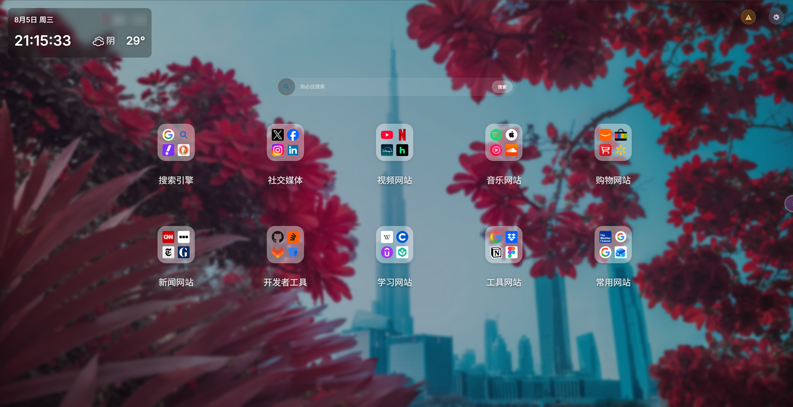

# HarborPage - 个人导航页面

一个基于 React + Vite + Cloudflare Workers 构建的现代化个人导航页面，支持网站图标管理、文件夹分类、搜索引擎切换、天气显示、待办事项、笔记、数据导入导出等功能。

## 界面预览

<div align="center">
  
</div>

## ✨ 功能特性

### 🌐 网站图标管理
- 添加、修改、删除网站快捷方式
- 多来源图标获取：HTML 解析、常见路径探测、多 Favicon 源 fallback
- 支持三种图标输入方式：图标 URL、文字（生成带颜色文字图标）、Emoji
- 图标智能获取对话框：自动从多种渠道收集候选图标供用户选择
- 图标缓存到 Cloudflare R2（可选），前端信号量并发控制（3 并发）
- 拖拽排序和移动图标
- 右键菜单快速操作
- 长按进入编辑模式

### 📁 文件夹功能
- 拖拽图标到另一个图标上创建文件夹
- 文件夹图标显示前4个网站的图标（田字形排列）
- 支持文件夹名称修改
- 拖拽图标移入/移出文件夹
- 空文件夹显示📁图标
- 支持整文件夹在页面之间移动（包含内部所有子网站）

### 🗂️ 多页面功能
- 页面级隔离：每个页面拥有独立的网站和文件夹集合
- 屏幕左缘半藏一颗「水晶球」开关（翠绿→琥珀身份色，六层渐变 + 呼吸辉光），悬停滑出、点击展开左侧 PagesSidebar 面板
- 页面创建、重命名、删除（至少保留一页）
- 拖拽排序页面（HTML5 原生拖拽 + 上下半区指示线）
- 网站/文件夹跨页移动：右键菜单「移动到页面…」，支持「仅移动」与「移动并跳转」
- 刷新页面默认显示第一页（当前选中的页面不写入持久化存储）
- 旧格式（根级 websites 无 pages）数据自动迁移至名为「默认页面」的页面
- 导入旧格式数据时始终落于「默认页面」（不存在则自动创建），导入完成后自动跳转到该页

### 🔍 搜索功能
- 多搜索引擎支持（Google、百度、必应等）
- 自定义添加、编辑、删除搜索引擎
- 搜索引擎图标自动获取
- 拖拽排序搜索引擎
- 主页面下拉快速切换搜索引擎（临时切换，不写入持久化，不触发保存提示）
- 设置面板中可修改默认搜索引擎（正常持久化、同步到云端）

### 🌤️ 天气显示
- 实时天气信息显示
- 支持浏览器定位和IP定位
- 和风天气API支持
- 显示当前温度和天气状态
- 显示时间和日期（点击日期切换农历）
- 时钟使用 ref 直接 DOM 操作，避免每秒触发 React 重渲染

### ✅ 待办事项
- 屏幕右缘半藏一颗「水晶球」开关（靛蓝→品红身份色，与页面侧开关同款画法），点击滑出待办侧边栏
- 添加、编辑、删除待办事项
- 标记完成状态
- 数据持久化存储到 Cloudflare KV
- 未完成数量徽章显示（叠加在开关球左上角）

### 📝 笔记功能
- 屏幕底部居中的「水晶球」便签栏：收起时只露半颗 📝 peek 球，鼠标悬停即整栏升起展开
- 笔记球最多显示 8 篇，每颗球按笔记颜色做成水晶球、取标题首字显示，悬停弹出缩略预览气泡（含更新时间与「编辑」入口）
- 笔记球支持拖拽排序；点击任意球直接打开编辑器（全文查看、修改标题/颜色/内容、保存或删除）
- 左侧「+」新建笔记（点「保存」才真正创建）、右侧「⚙︎」打开笔记管理器（查看全部、批量重排、重命名、调色、删除），超过 8 篇时叠加 +N 徽章
- 支持标题和内容、创建与更新时间记录

### 🎨 壁纸管理
- Bing每日壁纸
- 随机Bing壁纸
- 本地图片上传（R2 或 IndexedDB 降级存储）
- 纯色背景
- 模糊度和遮罩浓度调节
- 壁纸代理支持（域名白名单限制）
- 自动定时更换壁纸

### 📤 数据导入导出
- 分类导出：搜索引擎、网站、待办列表、笔记、其它设置
- 分类导入：勾选需要导入的数据类别
- 导入时自动检测文件中不存在的数据并禁用选择
- 导入进度条显示当前进度及任务内容
- 导入时遮罩层禁止用户操作
- 导入时 ID 冲突自动处理（合并模式生成新 ID）
- 导入后图标自动预缓存

### 🔐 安全认证
- JWT 登录认证
- 密码 SHA-256 加密传输
- 7天 Token 有效期
- 自动登出处理
- 敏感信息存储在 Cloudflare Secrets
- 构建产物自动清理 .dev.vars 机密文件

### ⚙️ 设置面板
- 图标行列数设置
- 壁纸设置
- 搜索引擎管理（弹出式对话框 + 拖拽排序）
- 图标源管理（自定义 Favicon 源配置）
- 待办事项管理
- 笔记管理
- 预设站点导入
- 数据导入导出
- 自动保存设置

### 💾 自动保存
- 未保存变更检测与提示
- 倒计时自动保存（可配置时长）
- 保存进度指示
- 手动保存与自动保存并存
- 页面刷新前未保存提示

## 🛠️ 技术栈

### 前端
- **React 19** - 用户界面库
- **TypeScript** - 类型安全
- **Vite 7** - 构建工具
- **Zustand 5** - 状态管理
- **lunisolar 2** - 农历日期转换
- **qweather-icons 1** - 天气图标
- **Crypto-JS** - SHA-256 加密

### 后端
- **Cloudflare Workers** - 无服务器计算
- **Cloudflare KV** - 数据存储
- **Cloudflare R2** - 图标文件存储
- **jose 6** - JWT 认证
- **Wrangler 4** - Cloudflare CLI 工具

## 📦 安装和部署

### 前置要求
- Node.js 18+
- Cloudflare 账号
- Wrangler CLI 4+

### 本地开发

```bash
# 安装依赖
npm install

# 复制环境变量配置
cp .dev.vars.sample .dev.vars
cp wrangler.sample.jsonc wrangler.jsonc

# 填写 .dev.vars 中的敏感信息
# 填写 wrangler.jsonc 中的 KV 和 R2 资源 ID

# 启动开发服务器（带热重载）
npm run dev
```

### 部署到 Cloudflare

```bash
# 构建项目
npm run build

# 部署到 Cloudflare Workers
npm run deploy
```

### 配置步骤

1. **创建 KV 命名空间**
   ```bash
   wrangler kv:namespace create USER_DATA
   ```

2. **创建 R2 存储桶（可选，用于图标缓存）**
   ```bash
   wrangler r2:bucket create harbor
   ```

3. **设置敏感环境变量（生产环境）**
   ```bash
   wrangler secret put PASSWORD
   wrangler secret put JWT_SECRET
   wrangler secret put WEATHER_API_KEY
   wrangler secret put WEATHER_API_HOST
   ```

4. **配置 wrangler.jsonc**
   - 将 KV 命名空间 ID 填入 `kv_namespaces[0].id`
   - 将 R2 存储桶名称填入 `r2_buckets[0].bucket_name`
   - 配置 `R2_URL`（启用 R2 CDN 时需要）

### 环境变量说明

| 变量名 | 说明 | 是否必需 |
|--------|------|----------|
| `PASSWORD` | 登录密码 | 是 |
| `JWT_SECRET` | JWT 签名密钥 | 是 |
| `WEATHER_API_KEY` | 和风天气 API 密钥 | 否 |
| `WEATHER_API_HOST` | 和风天气 API 主机地址 | 否 |
| `R2_URL` | R2 存储访问地址（启用 R2 CDN 时需要） | 否 |
| `ENABLE_R2_CDN` | 是否启用 R2 CDN（默认关闭） | 否 |

### KV 命名空间绑定
- `USER_DATA` - 用户数据存储

### R2 存储绑定
- `BUCKET` - 图标文件存储（可选）

## 🎯 使用指南

### 基本操作
1. **登录**：打开页面后输入密码登录
2. **切换页面**：点击屏幕左缘的翠绿→琥珀「水晶球」开关滑出 PagesSidebar，点击页面切换；拖拽手柄可重新排序
3. **新建页面**：PagesSidebar 顶部「+ 新建页面」按钮
4. **重命名/删除页面**：页面项右侧铅笔图标重命名（Enter 提交 / Esc 取消）、垃圾桶图标删除（需二次确认，至少保留一页）
5. **添加网站**：右键点击空白处进入编辑模式，点击"+"按钮添加新网站
6. **修改网站**：右键点击网站图标，选择"修改"
7. **删除网站**：右键点击网站图标，选择"删除"
8. **创建文件夹**：拖拽一个网站图标到另一个网站图标上
9. **移动图标**：拖拽网站图标到文件夹图标上移入文件夹
10. **移出文件夹**：在文件夹中拖拽图标到文件夹窗口外
11. **跨页移动网站/文件夹**：右键点击网站或文件夹 → 「移动到页面…」→ 选择「仅移动」或「移动并跳转」
12. **打开待办**：点击屏幕右缘的靛蓝→品红「水晶球」开关滑出待办侧边栏，左上角徽章实时显示未完成数量
13. **打开笔记栏**：鼠标悬停屏幕底部中央的 📝「水晶球」便签球即整栏展开——悬停笔记球看缩略预览、点击球打开编辑器、拖拽球排序、右侧「⚙︎」管理全部笔记

### 图标设置
- **留空**：自动获取网站 favicon
- **图标 URL**：直接填写图片链接
- **文字**：输入任意文字（如 "Ba"），生成带颜色的文字图标
- **Emoji**：输入 emoji 字符（如 🚀）
- **上传**：手动上传图标到 R2
- **智能获取**：自动从 HTML、常见路径、图标源获取候选图标

### 搜索功能
1. 在搜索框中输入关键词
2. 点击搜索引擎图标或下拉切换搜索引擎（**主页面切换为临时选择，刷新后回到默认搜索引擎**）
3. 按回车或点击搜索按钮执行搜索
4. 如需永久修改默认搜索引擎：设置面板 → 搜索设置 → 管理搜索引擎

### 壁纸设置
1. 点击设置按钮（⚙️）打开设置面板
2. 选择"壁纸设置"
3. 选择壁纸来源（Bing每日壁纸/随机Bing壁纸/本地图片/纯色背景）
4. 调整模糊度和遮罩浓度

### 数据导入导出
1. 打开设置面板
2. 选择"导入导出"
3. 导出：勾选需要导出的数据类别，点击导出
4. 导入：选择导入文件后，勾选需要导入的数据类别，确认导入
5. 导入过程中会显示进度条，禁止其他操作

## 📁 项目结构

```
harborpage/
├── src/                              # 前端源代码
│   ├── components/                   # React组件
│   │   ├── common/                   # 通用组件
│   │   │   ├── AutoFetchDialog.tsx   # 智能获取图标对话框
│   │   │   ├── ConfirmDialog.tsx     # 确认对话框
│   │   │   ├── DraggableIconWrapper.tsx
│   │   │   ├── EditWebsite.tsx       # 网站编辑表单
│   │   │   ├── ErrorBoundary.tsx     # 错误边界
│   │   │   ├── FolderItem.tsx        # 文件夹项
│   │   │   ├── FolderNameDialog.tsx  # 文件夹命名对话框
│   │   │   ├── IconGrid.tsx          # 图标网格
│   │   │   ├── IconItem.tsx          # 图标项
│   │   │   ├── ImportProgressOverlay.tsx # 导入进度遮罩
│   │   │   ├── LoginModal.tsx        # 登录弹窗
│   │   │   ├── MoveToPageDialog.tsx  # 跨页移动对话框
│   │   │   ├── Notes.tsx             # 笔记组件
│   │   │   ├── SavePrompt.tsx        # 保存提示组件
│   │   │   ├── SaveProgressIndicator.tsx
│   │   │   ├── SaveTooltip.tsx
│   │   │   ├── Toast.tsx             # 轻提示组件
│   │   │   ├── TodoList.tsx          # 待办列表
│   │   │   ├── TreeSelector.tsx      # 树形选择器
│   │   │   └── WebsiteItem.tsx       # 网站项
│   │   ├── features/                 # 功能组件
│   │   │   ├── FolderWindow.tsx      # 文件夹窗口
│   │   │   ├── PagesSidebar.tsx      # 页面侧边栏（多页面切换、排序、重命名、删除）
│   │   │   ├── Search.tsx            # 搜索栏
│   │   │   ├── SearchManager.tsx     # 搜索引擎管理
│   │   │   ├── TodoSidebar.tsx       # 待办侧边栏
│   │   │   ├── WallpaperManager.tsx  # 壁纸管理
│   │   │   └── Weather.tsx           # 天气显示
│   │   ├── layout/                   # 布局组件
│   │   │   ├── Background.tsx        # 背景层
│   │   │   └── IconsContainer.tsx    # 图标容器
│   │   └── ui/                       # UI组件
│   │       ├── FaviconSettings.tsx   # 图标源设置
│   │       ├── ImportExport.tsx      # 导入导出
│   │       ├── ImportPresetDialog.tsx # 预设站点导入
│   │       ├── Settings.tsx          # 设置面板
│   │       └── SettingsWindow.tsx    # 设置窗口
│   ├── data/                         # 数据文件
│   │   └── presetSites.json          # 预设站点数据
│   ├── hooks/                        # 自定义Hooks
│   │   ├── useAddWebsiteShortcut.ts  # 添加网站快捷键
│   │   ├── useAuth.ts                # 认证
│   │   ├── useAutoSave.ts            # 自动保存
│   │   ├── useAutoSaveSettings.ts    # 自动保存设置
│   │   ├── useClickOutside.ts        # 点击外部检测
│   │   ├── useDataInitialization.ts  # 数据初始化
│   │   ├── useDeleteIcon.ts          # 删除图标
│   │   ├── useDragAndDrop.ts         # 拖拽
│   │   ├── useIconDropHandler.ts     # 图标拖放处理
│   │   ├── useImport.ts              # 导入
│   │   ├── useLongPress.ts           # 长按
│   │   ├── useTreeSelection.ts       # 树形选择
│   │   ├── useWallpaperInit.ts       # 壁纸初始化
│   │   ├── useWeather.ts             # 天气
│   │   ├── useWeatherLocation.ts     # 天气定位
│   │   └── useWeatherLunar.ts        # 农历
│   ├── services/                     # 服务层
│   │   ├── AuthService.ts            # 认证服务
│   │   ├── autoFetchService.ts       # 智能获取图标服务
│   │   ├── ChangeTracker.ts          # 变更追踪
│   │   ├── ConfigService.ts          # 配置服务
│   │   ├── DataManager.ts            # 数据管理
│   │   ├── DataRepository.ts         # 数据仓库（统一持久化层）
│   │   ├── FaviconConfigService.ts   # Favicon源配置服务
│   │   ├── IconDownloadQueue.ts      # 图标下载队列（信号量并发）
│   │   ├── IconManager.ts            # 图标管理器
│   │   ├── iconUtils.ts              # 图标工具
│   │   ├── serviceContainer.ts       # 服务容器
│   │   ├── Services.ts               # 服务接口
│   │   └── storeInitializer.ts       # Store初始化
│   ├── store/                        # 状态管理（Zustand）
│   │   ├── index.ts
│   │   ├── persistence.ts            # 持久化
│   │   ├── selectors.ts              # 选择器
│   │   ├── useIconsStore.ts          # 图标状态（派生自 usePagesStore.currentPage）
│   │   ├── useIconsUIStore.ts        # 图标UI状态
│   │   ├── useImportStore.ts         # 导入状态
│   │   ├── useNotesStore.ts          # 笔记状态
│   │   ├── usePagesStore.ts          # 页面状态（多页面 + 页面级网站集合 + 跨页移动）
│   │   ├── useSearchStore.ts         # 搜索状态
│   │   ├── useSettingsStore.ts       # 设置状态
│   │   ├── useTodoStore.ts           # 待办状态
│   │   └── useWallpaperStore.ts      # 壁纸状态
│   ├── types/                        # 类型定义
│   │   └── index.ts
│   ├── utils/                        # 工具函数
│   │   ├── deviceUtils.ts            # 设备工具
│   │   ├── idUtils.ts                # ID生成
│   │   ├── importExportUtils.ts      # 导入导出工具
│   │   ├── logger.ts                 # 日志
│   │   └── wallpaperStorage.ts       # 壁纸存储
│   ├── App.tsx                       # 主应用组件
│   ├── main.tsx                      # 应用入口
│   └── index.css                     # 全局样式
├── worker/                           # Cloudflare Workers代码
│   ├── middleware/                   # 中间件
│   │   └── auth.ts                   # 认证中间件
│   ├── routes/                       # API路由
│   │   ├── auth.ts                   # 认证接口
│   │   ├── bing.ts                   # Bing壁纸接口
│   │   ├── data.ts                   # 数据接口
│   │   ├── icon.ts                   # 图标接口
│   │   ├── icon-cleanup.ts           # 图标清理
│   │   ├── icon-upload.ts            # 图标上传
│   │   ├── title.ts                  # 标题获取
│   │   ├── wallpaper.ts              # 壁纸代理
│   │   ├── wallpaper-upload.ts       # 壁纸上传
│   │   └── weather.ts                # 天气接口
│   ├── utils/                        # Worker工具函数
│   │   ├── constants.ts              # 常量
│   │   ├── crypto.ts                 # 加密工具
│   │   ├── icon.ts                   # 图标处理
│   │   ├── md5.ts                    # MD5哈希
│   │   └── streamLimit.ts            # 流限制
│   ├── index.ts                      # Worker入口文件
│   └── types.ts                      # Worker类型定义
├── public/                           # 静态资源
├── samples/                          # 设计参考样例
│   └── CrystalBall.html              # 水晶球视觉画法参考（六层渐变 + 呼吸辉光）
├── .dev.vars.sample                  # 本地环境变量示例
├── .env.sample                       # 前端构建变量示例
├── wrangler.sample.jsonc             # Wrangler配置示例
├── vite.config.ts                    # Vite配置
└── package.json                      # 项目配置
```

## 🔧 API 接口

### 认证
- `POST /api/login` - 用户登录
- `GET /api/auth/status` - 检查认证状态

### 数据管理
- `GET /api/data` - 获取全部用户数据
- `GET /api/data?key={key}` - 获取单个数据项
- `POST /api/data?key={key}` - 保存用户数据
- `DELETE /api/data?key={key}` - 删除用户数据

### 图标管理
- `GET /api/icon?type={type}&hashInput={hashInput}&downloadUrl={downloadUrl}` - 获取图标（从R2获取或下载）
- `POST /api/icon` - 下载并缓存图标到 R2
- `POST /api/icon/upload` - 上传图标（需认证，R2可用时，文件大小限制100KB）
- `DELETE /api/icon?type={type}&hashInput={hashInput}` - 删除图标（需认证）
- `DELETE /api/icon?action=cleanup` - 清理未使用的图标（需认证，支持分批清理）
- `GET /api/icon/autofetch?url={url}` - 获取网站图标候选列表（仅分析页面结构，不下载）
- `POST /api/icon/download` - 下载单个图标并返回 data URL（供前端并发调用）
- `POST /api/icon/autofetch/cache` - 将 data URL 图标缓存到 R2
- `POST /api/icon/cache-url` - 将指定 URL 的图标缓存到 R2

### 图标源管理
- `GET /api/favicon/sources` - 获取 Favicon 源配置
- `POST /api/favicon/sources` - 保存 Favicon 源配置

### 天气服务
- `GET /api/weather?lat={lat}&lon={lon}` - 获取天气信息
- `GET /api/geo?location={location}` - 城市搜索

### 壁纸代理
- `GET /api/wallpaper?url={url}` - 壁纸图片代理（域名白名单限制）
- `POST /api/wallpaper/upload` - 上传壁纸到 R2

### Bing API 代理
- `GET /api/bing/*` - 代理 Bing API 请求

### 标题获取
- `GET /api/title?url={url}` - 获取网站标题

## 🎨 自定义

### 添加自定义搜索引擎
1. 打开设置面板
2. 选择"搜索设置"
3. 点击"管理搜索引擎"
4. 点击添加或编辑现有搜索引擎

### 配置 Favicon 源
1. 打开设置面板
2. 选择"图标源设置"
3. 添加、编辑、删除或拖拽排序 Favicon 源
- 系统默认提供 Google、DuckDuckGo、gstatic 三个源
- 按优先级依次尝试，直到获取到有效图标

### 修改图标行列数
1. 打开设置面板
2. 选择"图标设置"
3. 调整行数和列数

### 启用 R2 图标缓存
1. 创建 R2 存储桶并绑定
2. 配置 `R2_URL` 环境变量
3. 设置 `ENABLE_R2_CDN` 为 `"true"`

## 📝 开发说明

### 组件化开发
项目采用组件化开发模式，每个功能模块都有独立的组件和样式文件。

### 视觉设计（水晶球体系）
- 页面（左缘）、待办（右缘）、笔记栏 peek（底缘）三个「边缘开关球」与笔记球统一采用 `samples/CrystalBall.html` 的水晶球画法
- 水晶球 = 同一元素上的六层渐变（深色玻璃底 → 低透明身份色内部光 → 主/次高光 → 底部月牙反光）+ inset 内壁折射 + 底部身份色氛围光，**不使用白描边环**（避免塑料感）
- 每颗球在自己的作用域声明 `--tint` / `--tint-2` 身份色与 7 个 `--ball-*` 派生变量（`color-mix` 生成）；CSS 变量不跨兄弟节点继承，兄弟节点（如侧边栏开关球）需本地重建颜色体系
- 呼吸辉光直接动画元素自身 box-shadow（模糊/扩散值扩张↔回缩），光晕钉在球缘、不产生 O 型环空隙；hover 提亮用 `filter: brightness(1.12)` 而非 saturate
- 呼吸动画默认 `paused`（避免静止时持续 raster 占用 CPU），仅在 hover / 展开时运行

### 交互健壮性
- 所有 `Node.contains()` 调用前先做 `relatedTarget instanceof Node` 守卫：鼠标快速甩出窗口时浏览器会把 relatedTarget 映射为 `window`，未守卫的 `contains(window)` 会抛 `TypeError` 并中断后续逻辑（曾导致笔记栏 hover 收起被卡死）
- 该守卫覆盖 NoteBar（栏移出/球拖拽/气泡穿越）、PagesSidebar、Todo 侧边栏、NotesManagerDialog、FolderWindow 及 useDragAndDrop / useClickOutside 全部相关路径

### 状态管理
使用 Zustand 进行全局状态管理，数据持久化到 Cloudflare KV。Store 选择器使用 `useShallow` 避免不必要的重渲染。

### 服务注入
服务通过 `serviceContainer` 动态获取，支持服务替换和测试。

### 数据持久化
- `DataRepository` 作为统一持久化层，禁止直接访问 localStorage
- 认证错误处理集中在 `DataRepository.handleAuthResponse()`
- `DataManager` 使用不可变更新（`this.data = { ...this.data, ... }`）
- localStorage 键统一使用 `harborpage_` 前缀
- 数据加载优先级：先读 localStorage，命中则直接返回不再请求 KV；localStorage 为空才走 Cloudflare KV API
- 持久化追踪键（TRACKED_KEYS）：`settings / websites / searchEngines / todos / todoList / notes / wallpaper / pages`
  - `pages` 取代根级 `websites` 作为网站/文件夹的唯一真源，根级 `websites` 在 persist 时被清空
  - `currentPageId` **不被持久化**，刷新页面永远显示第一页（导入旧数据触发切默认页的特殊路径除外）
- `saveToLocal` 默认 500ms 防抖写 localStorage；关键原子操作（如跨页移动）使用 `DataRepository.flushLocal` 立即写入，避免用户立刻刷新读到旧值

### 图标缓存机制
- 前端通过信号量模式控制并发（3 个并发请求）
- 图标缓存失败后显示 🌐 图标，避免重复请求
- 多源 Fallback：Google → DuckDuckGo → gstatic → mzkit
- Favicon 源由后端统一管理，前端通过 API 获取

### 图标文件命名规则
- 用户上传图标：`md5("upload_{id}_{timestamp}").png`
- 预览保存图标：`md5("save_{id}_{timestamp}").png`
- 智能获取缓存图标：`md5("cache_{id}_{timestamp}").png`
- 自动 Favicon 缓存：`md5(domain).png`（固定文件名，便于预测）
- R2 存储路径前缀：`WebSites/`、`SearchEngines/`

### 安全规范
- JWT 认证保护所有敏感 API
- 密码 SHA-256 加密传输
- 壁纸代理域名白名单限制
- 请求大小限制（壁纸最大 10MB）
- 敏感变量存储在 `.dev.vars`（本地）或 Cloudflare Secrets（生产）
- 构建产物自动清理 `.dev.vars`（通过 `devVarsCleanup` 插件）

### 性能优化
- 时钟组件使用 ref 直接 DOM 操作，避免每秒触发 React 重渲染
- 图标下载使用信号量并发控制（3 并发）
- URL 输入防抖（3 秒）后更新预览
- Store 选择器使用 `useShallow` 减少不必要的重渲染
- `useEffect` 依赖项精确控制，避免循环触发

## 🤝 贡献

欢迎提交 Issue 和 Pull Request！

## 📄 许可证

MIT License

## 🙏 致谢

- [React](https://react.dev/)
- [Vite](https://vitejs.dev/)
- [Cloudflare Workers](https://workers.cloudflare.com/)
- [和风天气](https://www.qweather.com/)
- [Zustand](https://zustand-demo.pmnd.rs/)
- [lunisolar](https://lunisolar.js.org/)
- [qweather-icons](https://github.com/qwd/Icons)
